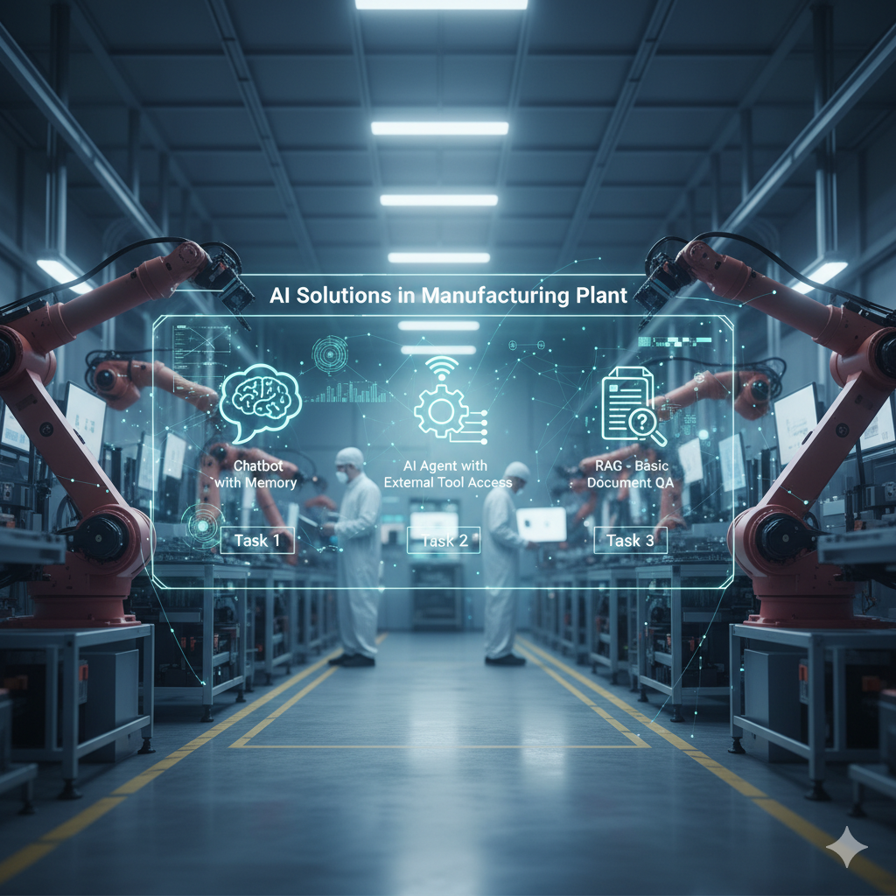

# AI Solutions for Manufacturing Plant

Welcome to the **AI Solutions in Manufacturing Plant**! This repository contains solutions for three exciting AI tasks, showcasing implementations ranging from memory-enabled chatbots to advanced document question-answering systems. Each task is organized in its own folder with a dedicated README detailing the implementation, usage, and instructions.

## Tasks Overview

### **Task 1: Chatbot with Memory**

This solution demonstrates a chatbot capable of **remembering previous interactions** to provide more contextually relevant and coherent responses. The chatbot can store user inputs and retrieve context from past conversations to enhance user experience.

📂 **[Click here to explore Task 1](https://github.com/surajsamm/Manufacturing-Plant-AI-Solutions/tree/main/task-01-Chatbot%20with%20memory)**

---

### **Task 2: AI Agent with External Tool Access**

This AI agent goes beyond simple conversation by **interacting with external tools** and APIs. It can perform tasks that require fetching real-time information, processing data, or integrating with other services to solve complex problems efficiently.

📂 **[Click here to explore Task 2](https://github.com/surajsamm/Manufacturing-Plant-AI-Solutions/tree/main/task-02-AI%20Agent%20with%20External%20Tool%20Access)**

---

### **Task 3: RAG - Part 1 (Basic Document QA)**

This solution implements a **Retrieval-Augmented Generation (RAG)** system for **basic document-based question answering**. The system retrieves relevant document sections to answer user queries accurately, combining retrieval and generation for robust QA capabilities.

📂 **[Click here to explore Task 3](https://github.com/surajsamm/Manufacturing-Plant-AI-Solutions/tree/main/task-03-RAG%20-%20Part%201)**

---

### **Task 4: RAG - Part 2 (AI Agent with External Tool Access)**

📂 **[Click here to explore Task 4](https://github.com/surajsamm/Manufacturing-Plant-AI-Solutions/tree/main/task-04-RAG%20-%20Part%202)**

---
### 📁 Task 05: SQL QA System (E-commerce / Manufacturing Data)

**Objective:**  
Query structured manufacturing and supply chain data using natural language.

**Database Schema:**
- `clients(client_id, name, age, risk_profile, portfolio_value)`
- `investments(investment_id, client_id, fund_name, amount_invested, date)`
- `machines(id, name, uptime_hours, downtime_hours, efficiency)`
- `suppliers(id, name, material, delivery_time, reliability_score)`

**Key Features:**
- Translate natural language questions into SQL queries using LangChain.
- Execute SQL queries on SQLite database.
- Return answers in human-readable format.

**Usage:**
1. Load sample SQLite database with `clients`, `investments`, `machines`, `suppliers`.
2. Use `generate_sql(question)` to generate SQL queries.
3. Execute queries with `execute_sql_and_summarize()` function.
4. Summaries of queries are saved in the `query_summaries/` folder.

**Dependencies:**
- Python 3.11+
- langchain
- groq
- sqlite3

**Example Questions:**
- "List suppliers with delivery delays over 5 days and reliability score < 70."
- "Which machines have efficiency below 92?"
- "Show total units produced by each machine."
- "Find the machine with the highest defect rate."
  
📂 **[Click here to explore Task 5](https://github.com/surajsamm/gg/tree/main/task-05-SQL%20QA%20System))**

---

### 📁 Task 06: Summarization Engine

**Objective:**  
Summarize large operational or compliance documents into concise reports.

**Key Features:**
- Load PDFs or text files from `sample_documents/`.
- Split large documents into manageable chunks using `RecursiveCharacterTextSplitter`.
- Summarize each chunk using **Groq LLaMA 3.3-70b-versatile** model.
- Combine summaries into a final report (`final_summary.txt`).

**Workflow:**
1. Load documents using `PyPDFLoader` or `TextLoader`.
2. Split documents into chunks for large files.
3. Summarize each chunk individually using Groq API.
4. Merge summaries for a consolidated overview.

**Dependencies:**
- Python 3.11+
- langchain
- groq
- PyPDF2 or pypdf
- os

📂 **[Click here to explore Task 6](https://github.com/surajsamm/gg/tree/main/task-06-summarization)**

---

## 📁 Task 08: Workflow Automation with n8n

**Objective:**  
Automate alerts and supplier communications based on operational data.

**Use Cases:**
- Alert supervisor if machine downtime exceeds 4 hours.
- Send automatic email to supplier if raw material stock drops below threshold.
- Notify Slack channel if defect rate crosses 5% for a production batch.

**Implementation:**
- Use n8n.io (cloud or self-hosted).
- Connect Webhook node to receive data from LangChain pipelines.
- Transform data using JavaScript/Function nodes.
- Send alerts using Gmail, Slack, or HTTP nodes.
- Log QA outputs into Google Sheets or Airtable.

**Data Sources:**
- LangChain outputs (RAG, SQL QA, Summarization pipelines).

**Files:**
- `n8n_workflow.json`: Pre-built workflow for automation.
- README.md explains integration with LangChain outputs.

**Dependencies:**
- n8n (cloud or local)
- Slack / Gmail / Google Sheet integrations
- Webhook endpoint for LangChain data

📂 **[Click here to explore Task 8](https://github.com/surajsamm/gg/tree/main/task-08-workflow-automation)**

---

